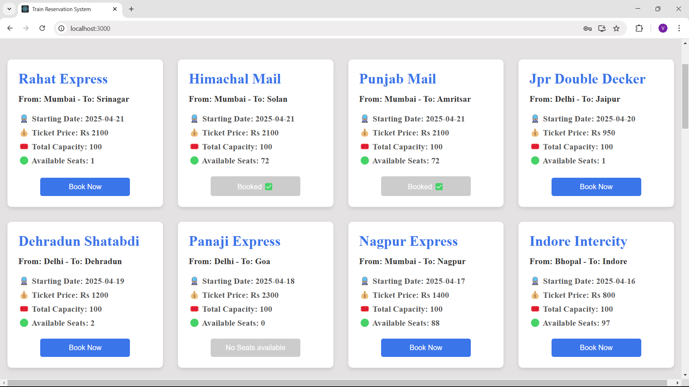
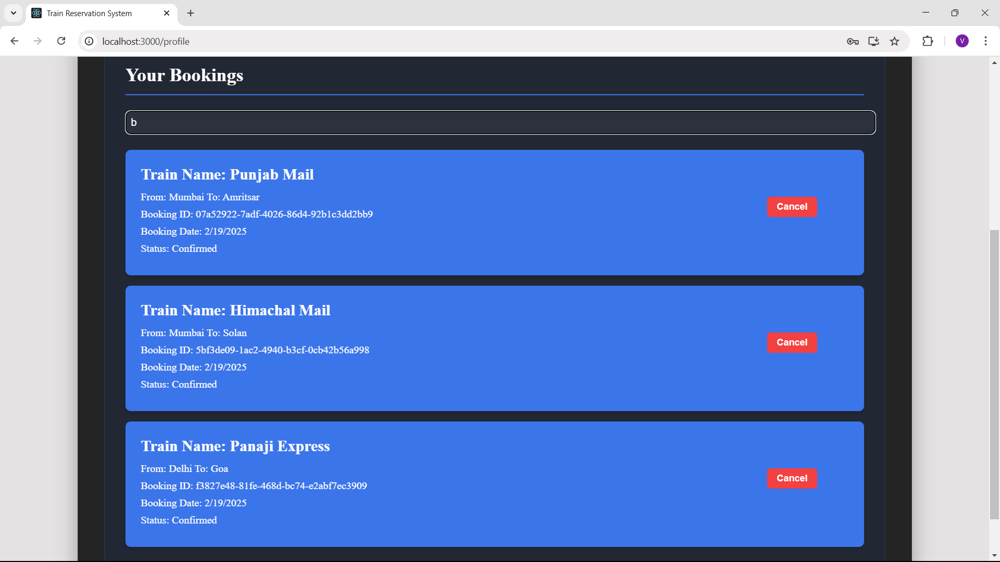

# Simple Railway Reservation System - MERN

## How to Run on Your System

### Frontend Setup

1. Open the folder in VS Code.
2. Open the VS Code terminal.
3. Navigate to the client folder:
   ```sh
   cd client
   ```
4. Install dependencies:
   ```sh
   npm install
   ```
5. Start the frontend server:
   ```sh
   npm start
   ```

Now, the frontend part will run on `http://localhost:3000/`.

### Backend Setup

1. Open a new VS Code terminal.
2. Navigate to the server folder:
   ```sh
   cd server
   ```
3. Install dependencies:
   ```sh
   npm install
   ```
4. Start the backend server:
   ```sh
   nodemon server.js
   ```

Now, both the frontend and backend linked with each other and system is ready to use. 

### Proof of Work


### Preview



### Login Credentials

To log in, use the following test credentials:

- **Email:** `testuser01@gmail.com`
- **Password:** `test01@`

## Tech Stack

- **React** - Frontend
- **Express** - Backend/API
- **MongoDB** - Database
- **Node.js** - Runtime
- **Mongoose** - ORM for Database

### Additional Tools

- **Postman** - For API Testing

---

## Thank You
